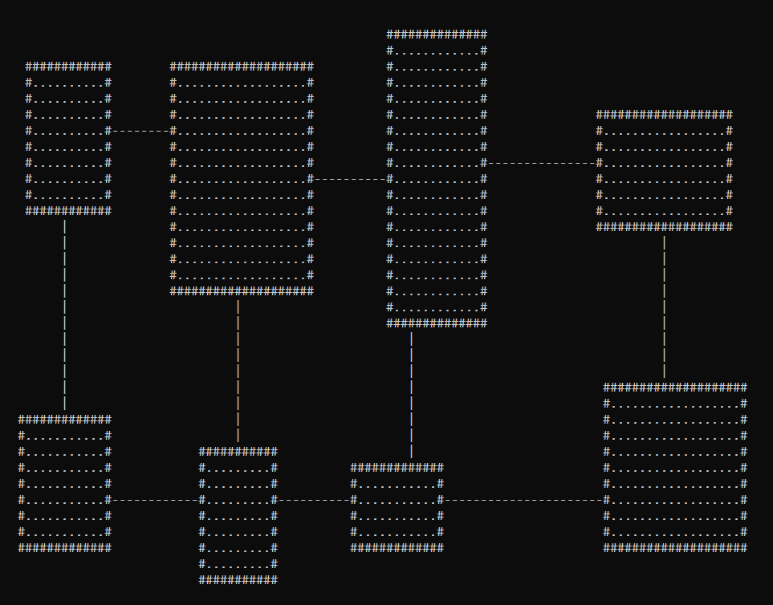

# RoguelikeRoomGeneration

Working on algorithms to generate rooms for a roguelike game

ProceduralLevelGeneration is a .NET 5 console project that just generates
random rooms on a map. The rooms are not connected yet. This project only
exists to work on the algorithm. This will be done when rooms can be connected.

## Status

- RoomGenerator1 is okay but each corridor is straight and sort of boring
- RoomGenerator2 can create Z shaped corridors but only if rooms line up
  horizontally (eg. it's not finished)

## Screenshot(s)

## Author(s)

- Frank Hale &lt;frankhaledevelops@gmail.com&gt;
- Melinda Hale

18 February 2021
