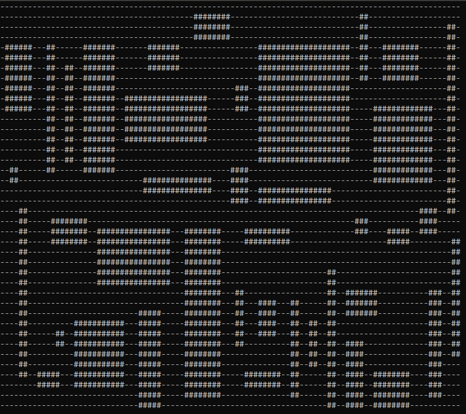
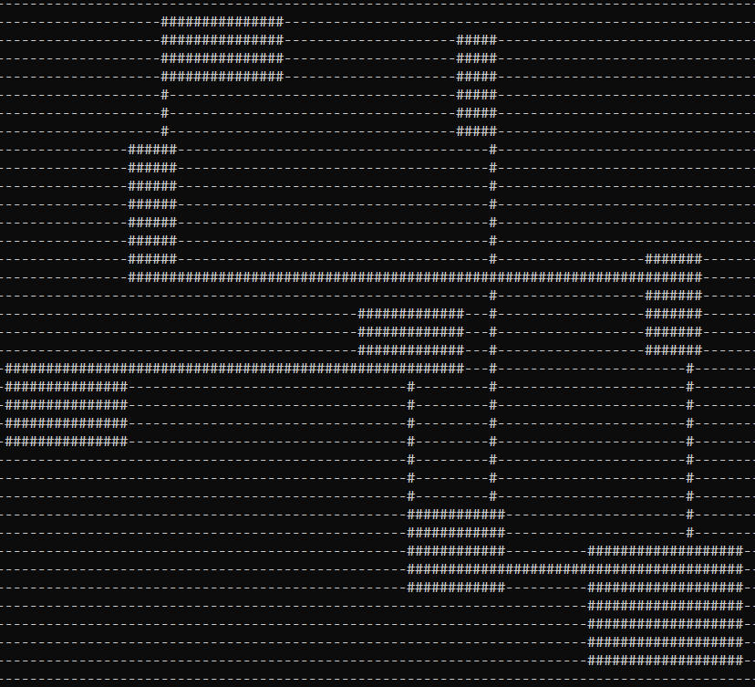
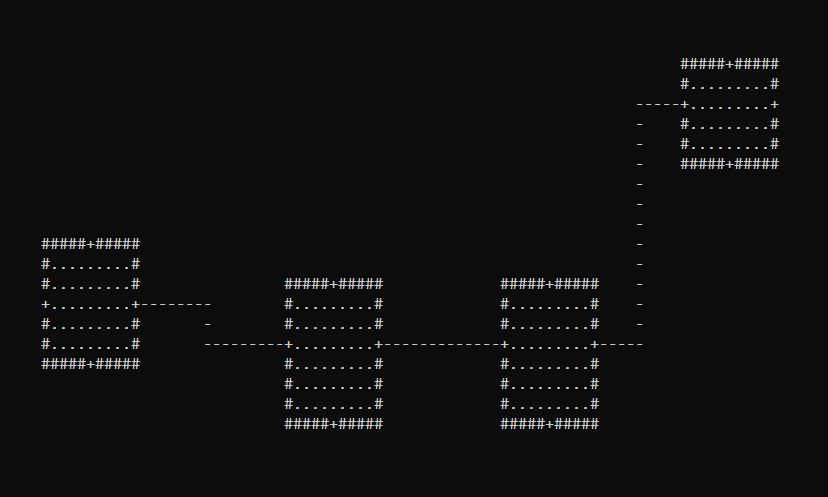

# RoguelikeRoomGeneration

Working on algorithms to generate rooms for a roguelike game

ProceduralLevelGeneration is a .NET 5 console project that just generates 
random rooms on a map. The rooms are not connected yet. This project only 
exists to work on the algorithm. This will be done when rooms can be connected.

## Status

Sometimes rooms won't have a corridor. I am working to resolve this.

## Screenshot(s)

## Author(s)

- Frank Hale &lt;frankhaledevelops@gmail.com&gt;
- Melinda Hale

16 February 2021
